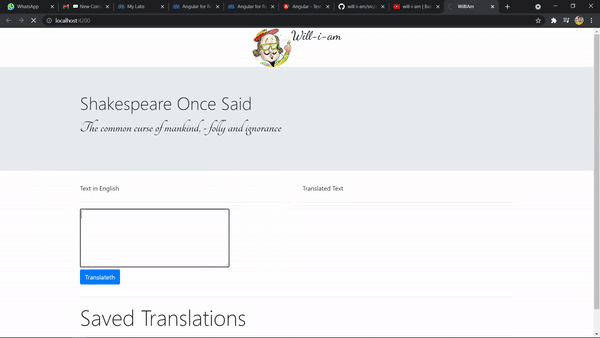

# WillIAm
will-i-am is a basic angular app to translate plain English to fun Shakespeare English using the API.

This project was generated with [Angular CLI](https://github.com/angular/angular-cli) version 12.0.2.

## Development server

Run `ng serve` for a dev server. Navigate to `http://localhost:4200/`. The app will automatically reload if you change any of the source files.

